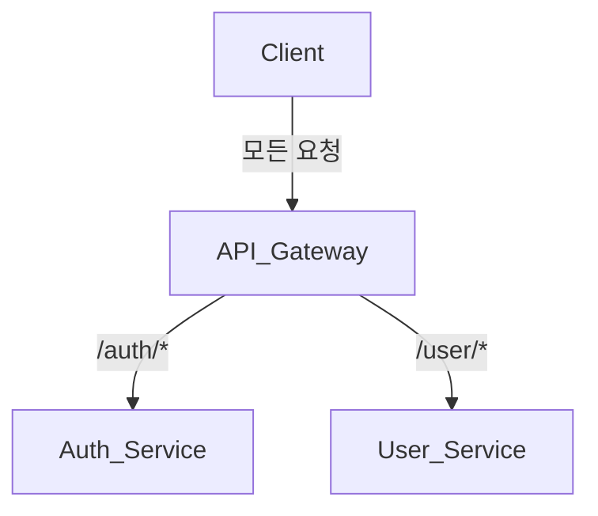

#  Automation\_modules - MSA 기반 인증·사용자 관리 시스템

> 본 프로젝트는 **Microservices Architecture (MSA)** 기반으로 구축된 인증 및 유저 관리 시스템입니다. 각 서비스는 독립적으로 실행되며, **API Gateway**를 통해 요청을 중앙에서 처리하고 분기합니다.

---

## 📁 프로젝트 디렉토리 구조


---


```
automation_modules/
├── api-gateway/         # 요청 라우팅, 인증 필터링
├── services/
│   ├── auth-service/    # JWT + Redis 기반 인증 서비스
│   └── user-service/    # 사용자 정보 CRUD 처리 서비스
└── README.md            # 프로젝트 설명 문서
```

| 서비스                 | 설명                                | 문서 링크                                         |
| ------------------- | --------------------------------- | --------------------------------------------- |
| 🟣 **Auth Service** | 로그인, 토큰 발급, 세션 제어 및 보안 흐름 처리      | [🔗 설계 문서](./services/auth-service/README.md) |
| 🔵 **User Service** | 사용자 정보 등록, 조회, 수정, 마이페이지 등 도메인 책임 | [🔗 설계 문서](./services/user-service/README.md) |
| 🟠 **API Gateway**  | 모든 요청 라우팅, JWT 필터링 및 인증 처리 분기     | [🔗 설계 문서](./api-gateway/README.md)           |

> 전체 구조 이해를 위한 첫 진입점으로 본 표를 참고하시기 바랍니다.

---

##  시스템 흐름 요약



* 모든 요청은 **API Gateway**를 통해 유입되며,
* 인증 관련은 `auth-service`, 유저 관련은 `user-service`로 분기됩니다.
* AccessToken이 필요하며, Gateway에서 **JWT 검증 후 라우팅**됩니다.

---

##  기술 스택

| 항목     | 사용 기술                          |
| ------ | ------------------------------ |
| 언어     | TypeScript                     |
| 런타임    | Node.js (Express)              |
| 인증     | JWT, RefreshToken, Redis 세션 제어 |
| 데이터베이스 | PostgreSQL                     |
| ORM    | TypeORM                        |
| 캐시/세션  | Redis (TTL 기반)                 |
| 배포     | Docker, Docker Compose         |
| 문서화    | Swagger (예정)                   |

---

##  실행 방법 (Docker 기반)

### 1. 환경 변수 설정

각 서비스에 `.env` 파일을 생성하고, 다음 항목을 설정합니다:

```
# PostgreSQL
DB_HOST=localhost
DB_PORT=5432
DB_USER=your_user
DB_PASSWORD=your_password
DB_NAME=user_service

# 서비스 포트
SERVICE_PORT=3001

# 로그 설정 (옵션)
LOG_LEVEL=debug
LOG_PATH=./logs/app.log

# 기타 (확장성 고려)
NODE_ENV=development
```

### 2. 전체 서비스 실행

```bash
# 루트 디렉토리에서 실행
docker compose up --build
```

> *독립 실행도 가능하지만, 전체 흐름 확인을 위해 `docker compose` 사용을 권장합니다.*

---

## 🔐 보안 및 설계 특징

*  **API Gateway 기반 요청 라우팅 및 인증 검증**
*  **userAgent + IP 조합 기반 Redis 세션 단일화** → 중복 로그인 방지
*  **TTL 기반 세션 자동 만료 관리**
*  **RefreshToken 서버 저장 구조**로 탈취 대응력 확보
*  **서비스 간 책임 분리** → 인증/유저 기능의 독립 유지보수 가능

---

##  테스트 및 운영 전략

| 항목      | 설명                                   |
| ------- | ------------------------------------ |
| 유닛 테스트  | Jest 기반 서비스 로직 단위 검증                 |
| 통합 테스트  | 로그인 → 인증 검증 → 유저 조회 흐름 테스트           |
| CI/CD   | GitHub Actions + Docker 기반 자동화 구축 예정 |
| 로깅 및 추적 | Winston 기반 로깅 / Kafka + ELK 연동 계획 중  |

---

##  작성자 정보

| 이름  | 역할                         | 링크                                                                                |
| --- | -------------------------- | --------------------------------------------------------------------------------- |
| 박경도 | 백엔드 개발자 (Node.js, TS, MSA) | [GitHub](https://github.com/Mirandalaw) · [Blog](https://jeong-park.tistory.com/) |

