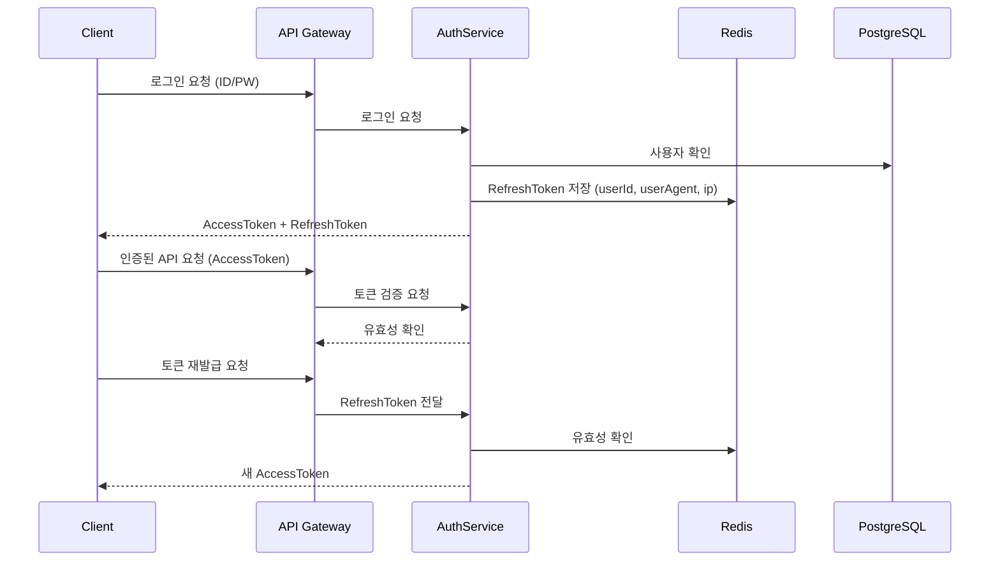

#  Auth Service - Secure, Session-Aware Authentication API

JWT + RefreshToken 기반의 인증 시스템으로  
단순 로그인/회원가입을 넘어 **보안, 확장성, 세션관리**를 포함한 실전형 인증 백엔드입니다.

>  실서비스 수준의 인증 흐름을 재현하며, MSA 환경에서 API Gateway와 통합 가능한 구조로 설계되었습니다.

---

##  Why This Service?

- **단일 로그인 보장**: userAgent + IP 기반의 세션 제어 → 중복 로그인 차단
- **보안 중심 설계**: RefreshToken 저장소로 Redis 사용, 토큰 만료/회수 관리 포함
- **운영 친화적 구조**: Docker 기반 배포, 모듈 분리, 서비스 확장성 고려

---

##  기술 스택

| 범주        | 기술 요소                            |
|-------------|---------------------------------------|
| Language    | TypeScript                            |
| Backend     | Node.js (Express)                     |
| Auth        | JWT, Refresh Token                    |
| DB          | PostgreSQL                            |
| Cache       | Redis (Session / Token Store)         |
| ORM         | TypeORM                               |
| Infra       | Docker, Docker Compose                |
| Docs        | Swagger (OpenAPI)                     |
| Logger      | Winston                                |
| Validator   | class-validator, DTO-based validation |
| Test        | Jest (단위 테스트)                     |

---

##  주요 기능

| 기능                    | 설명 |
|-------------------------|------|
| 회원가입 / 로그인        | 이메일 + 비밀번호 기반 인증 |
| Access/Refresh Token 발급 | AccessToken은 짧은 생명, RefreshToken은 Redis에 저장 |
| 세션 관리               | 각 로그인 세션은 userAgent + IP로 구분되어 Redis에 저장 |
| 중복 로그인 차단        | 동일 유저가 다른 브라우저에서 로그인 시 기존 세션 무효화 |
| 토큰 재발급             | RefreshToken 만료 여부 확인 → 재로그인 or 자동 재발급 |
| 비밀번호 재설정 / 이메일 찾기 | 이메일 인증 기반 로직 포함 |
| 자동 만료 정책          | Redis TTL 설정 기반 세션 자동 만료 |
| 관리자 로그 아카이브     | 인증 시도 기록 (예정 기능) |

---

##  인증 플로우 (시퀀스 다이어그램)



## ⚙️ 실행 방법

### 1. 환경 변수 설정

루트 디렉토리에 `.env` 파일을 생성하고 아래와 같이 작성하세요.

```env
# PostgreSQL
DB_HOST=localhost
DB_PORT=5432
DB_USER=your_user
DB_PASSWORD=your_password
DB_NAME=auth_service

# Redis
REDIS_HOST=localhost
REDIS_PORT=6379

# JWT 설정
JWT_SECRET=your_jwt_secret
JWT_EXPIRES_IN=15m
REFRESH_TOKEN_EXPIRES_IN=7d

# 서비스 포트
SERVICE_PORT=3000
```

### 2. Docker Compose로 실행

```bash
docker compose up --build
```

### 3. Swagger API 문서
준비중...

---

##  트러블슈팅 & 개선 이력

| 이슈 또는 상황 | 해결 방법 / 개선 내역 |
|----------------|------------------------|
| Refresh Token 탈취 가능성 | Redis에 저장된 토큰마다 userAgent + IP 정보를 함께 저장하여 탈취 대응 |
| 중복 로그인 허용 문제 | 동일한 userId의 세션이 여러 개일 경우 기존 세션 무효화 처리 추가 |
| 세션 자동 만료 누락 | Redis TTL(Time To Live) 설정으로 세션 자동 만료 적용 |
| Access Token 만료 처리 | 미들웨어에서 Access Token 만료 시, RefreshToken 통해 자동 재발급 구현 |
| 비밀번호 재설정 시 인증 토큰 재사용 문제 | 인증 토큰 1회성 처리 + 만료 시간 설정 추가 |

---

## 📈 개선 예정 항목

- [ ] Google OAuth2 로그인 연동
- [ ] 관리자 전용 로그인 이력 조회 API
- [ ] 로그인 시도 실패 알림 기능 (보안 알림)
- [ ] 2FA (Two-Factor Authentication) 연동
- [ ] GitHub Actions 기반 CI/CD 자동 배포 파이프라인
- [ ] 테스트 커버리지 90% 이상 달성 및 통합 테스트 도입
- [ ] 이벤트 기반 로그 수집 시스템 연동 (예: Kafka + ELK)

---

## ✍ 작성자 정보

| 이름   | 포지션            | 링크 |
|--------|-------------------|------|
| 박경도 | 백엔드 개발자 (Node.js, TS) | [GitHub](https://github.com/Mirandalaw) · [블로그](https://jeong-park.tistory.com/)) |

> 본 서비스는 실제 사용자 인증 흐름과 운영 환경을 기반으로 설계되었으며,  
> 실무에서 발생 가능한 보안/세션 이슈를 예방하고 유지보수 가능한 구조로 설계되었습니다.

---
