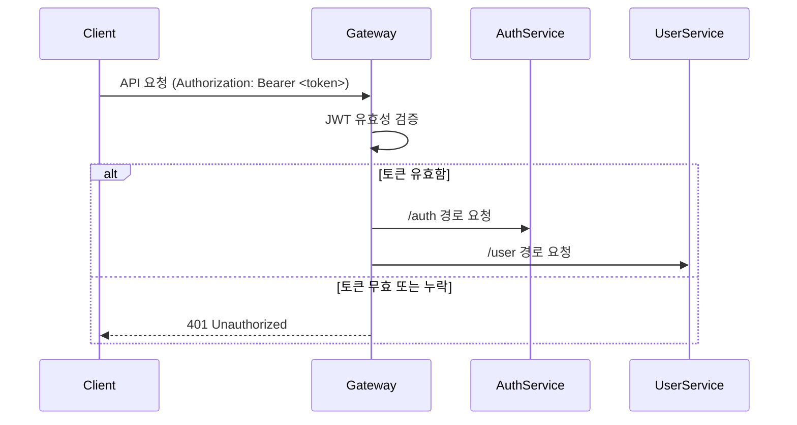

#  API Gateway - MSA 기반 요청 라우팅 허브

> 이 모듈은 `automation_modules` 프로젝트에서 모든 외부 요청의 **중앙 진입점 역할**을 수행하는 **API Gateway**입니다. 인증 필터링, 서비스 분기 처리, 보안 제어 등 클라이언트와 마이크로서비스 간의 연결을 책임집니다.

---

##  주요 개요

| 항목       | 설명                                     |
| -------- | -------------------------------------- |
| 역할       | 클라이언트 요청을 인증 후 각 마이크로서비스로 분기 처리        |
| 구성 목적    | 인증과 서비스 분리된 MSA 아키텍처에서의 중앙 관제 기능 수행    |
| 토큰 처리 방식 | HTTP Header의 Bearer Token 유효성 검사 후 라우팅 |
| 연동 서비스   | `auth-service`, `user-service` 등 확장 가능 |

---

## 🗂️ 디렉토리 구조

```
api-gateway/
├── src/
│   ├── middlewares/     # 인증 필터, 에러 핸들링 등
│   ├── routes/          # /auth, /user 등 요청별 분기 처리
│   ├── utils/           # JWT 파싱, 응답 유틸 함수
│   └── index.ts         # 서버 진입점
├── .env                 # 서비스 설정 파일
└── Dockerfile           # 컨테이너 실행 정의
```

---

## 🔐 인증 처리 흐름



---

##  실행 방법

### 1. 환경 변수 설정 (`.env`)

```env
AUTH_SERVICE_URL=http://auth-service:3000
USER_SERVICE_URL=http://user-service:3001
PORT=8080
JWT_SECRET=your_jwt_secret
```

### 2. 실행 명령어

```bash
# 로컬 개발 환경
npm install && npm run dev

# Docker 실행
docker build -t api-gateway .
docker run -p 8080:8080 --env-file .env api-gateway
```

---

##  현재 지원 기능 요약

| 기능         | 설명                                                  |
| ---------- | --------------------------------------------------- |
| 요청 경로 분기   | /auth → auth-service, /user → user-service 등 동적 라우팅 |
| JWT 인증 필터링 | 모든 요청에서 AccessToken 존재 및 유효성 검사                     |
| 에러 응답 처리   | 유효하지 않은 요청에 대해 일관된 JSON 응답 반환                       |
| 확장성 고려 구조  | 신규 서비스 추가 시 라우터만 등록하면 연동 가능                         |

---

##  향후 개선 예정 사항

* [ ] 요청/응답 로그 기록 (Winston 기반)
* [ ] 인증 실패 시 Rate-Limiting 적용
* [ ] OpenAPI 기반 서비스 매핑 자동화
* [ ] 토큰 Blacklist Redis 연동
* [ ] 헬스체크 및 서비스 상태 모니터링 추가

---

##  작성자 정보

| 이름  | 역할                       | 링크                                      |
| --- | ------------------------ | --------------------------------------- |
| 박경도 | 백엔드 개발자 (API Gateway 설계) | [GitHub](https://github.com/Mirandalaw) |

> 이 문서는 인사 담당자 및 기술 리뷰어가 Gateway의 역할과 설계를 빠르게 이해하고 검토할 수 있도록 구성된 기술 문서입니다.
