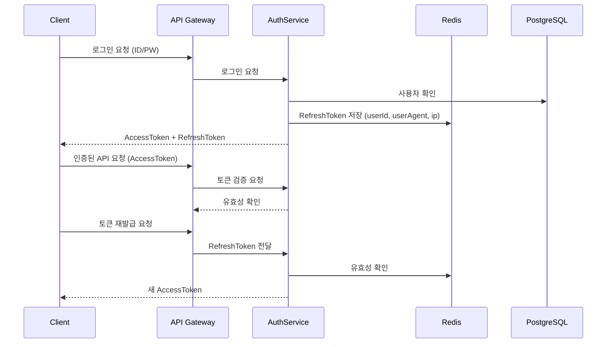

#  Auth Service - JWT + Redis + MSA 기반

JWT + RefreshToken 기반의 인증 시스템으로  
단순 로그인/회원가입을 넘어 **보안, 확장성, 세션관리**를 포함한 실전형 인증 백엔드입니다.

>  실서비스 수준의 인증 흐름을 재현하며, MSA 환경에서 API Gateway와 통합 가능한 구조로 설계되었습니다.

---

## 프로젝트 개요

| 항목 | 내용 |
|------|------|
| 목적 | 인증 서비스 단독 모듈화(MSA) + 실무 보안 구조 학습 |
| 주요 기능 | JWT 기반 로그인/회원가입, Redis 세션 제어, 중복 로그인 방지, 이메일 인증 기반 복구 기능 등 |

---

##  기술 스택

| 범주        | 기술 요소                            |
|-------------|---------------------------------------|
| Language    | TypeScript                            |
| Backend     | Node.js (Express)                     |
| Auth        | JWT, Refresh Token                    |
| DB          | PostgreSQL                            |
| Cache       | Redis (Session / Token Store)         |
| ORM         | TypeORM                               |
| Infra       | Docker, Docker Compose                |
| Docs        | Swagger (OpenAPI)                     |
| Logger      | Winston                                |
| Validator   | class-validator, DTO-based validation |
| Test        | Jest (단위 테스트)                     |

---

##  주요 기능 상세

| 카테고리 | 기능명 | 설명 |
|----------|--------|------|
| 인증 | 이메일 기반 회원가입 / 로그인 | bcrypt 해싱 + JWT 발급 |
| 토큰 관리 | Access / Refresh Token 발급 | AccessToken은 클라이언트 보관, RefreshToken은 Redis 저장 |
| 세션 제어 | Redis 기반 세션 관리 | userId + userAgent 기준으로 세션 키 구성 |
| 중복 로그인 차단 | 1인 1세션 원칙 | 기존 세션 강제 만료, 새 세션으로 교체 |
| 토큰 재발급 | RefreshToken으로 AccessToken 갱신 | Redis에 세션 존재 확인 후 재발급 |
| 로그아웃 처리 | Redis 세션 삭제 | 로그아웃 시 토큰 무효화 |
| 이메일 인증 | 이메일 찾기 / 비밀번호 초기화 | 인증 코드 1회 발급 + TTL 설정 |
| 자동 만료 정책 | 세션 TTL 적용 | Redis TTL 설정으로 자동 만료 처리 |
| 보안 로깅 (예정) | 로그인 이력 저장 | 관리자용 이력 조회 기능 예정 |

---


## 폴더 구조

```
auth-service/
├── src/modules/auth
│   ├── controllers/       # 라우터 핸들러
│   ├── services/          # 비즈니스 로직 (Usecase 기반)
│   ├── repositories/      # DB 접근 로직
│   ├── factories/         # 객체 생성 로직 (Factory Pattern)
│   ├── middlewares/       # 인증, 에러 핸들링
│   ├── utils/             # 공통 유틸 함수
│   ├── dtos/              # 요청/응답 DTO 정의
│   └── configs/           # 환경 설정, DB/Redis 설정
├── test/                  # 단위 테스트
├── docker-compose.yml     # 로컬 통합 실행 환경
└── README.md
```

--- 

##  시스템 구성 (MSA 흐름)

```
[Client] → [API Gateway] → [auth-service] → [user-service]
                          ↘︎ Redis ↙︎      ↘︎ DB ↙︎
```

- API Gateway를 통해 인증 요청을 분기
- AccessToken/RefreshToken 기반 인증 흐름
- Redis에 사용자 세션 정보, 토큰 TTL 저장

---

##  세션 제어 구조

```
[ 로그인 시 ]
- 유저 인증 성공 → AccessToken + RefreshToken 발급
- Redis.set(`session:{userId}:{userAgent}`, RefreshToken, TTL)

[ 인증 요청 시 ]
- AccessToken 만료 → RefreshToken 요청
- Redis에 session 존재 여부 확인 후 새 AccessToken 발급

[ 로그아웃 시 ]
- Redis에서 해당 session 삭제
```

---

##  인증 플로우 (시퀀스 다이어그램)



## ⚙️ 실행 방법

### 1. 환경 변수 설정

루트 디렉토리에 `.env` 파일을 생성하고 아래와 같이 작성하세요.

```env
# PostgreSQL
DB_HOST=localhost
DB_PORT=5432
DB_USER=your_user
DB_PASSWORD=your_password
DB_NAME=auth_service

# Redis
REDIS_HOST=localhost
REDIS_PORT=6379

# JWT 설정
JWT_SECRET=your_jwt_secret
JWT_EXPIRES_IN=15m
REFRESH_TOKEN_EXPIRES_IN=7d

# 서비스 포트
SERVICE_PORT=3000
```

### 2. Docker Compose로 실행

```bash
docker compose up --build
```

### 3. 로컬에서 실행
```
npm install
npm run dev
```

---


##  테스트 전략

| 항목           | 방식                  |
|----------------|-----------------------|
| 유닛 테스트    | 각 usecase / repository 단위 테스트 |
| 통합 테스트    | 로그인 → 재발급 전체 플로우 테스트 |
| 테스트 커버리지 | 90% 이상 목표, `npm run test:cov` |

---

##  트러블슈팅 & 개선 이력

| 이슈 또는 상황 | 해결 방법 / 개선 내역 |
|----------------|------------------------|
| Refresh Token 탈취 가능성 | Redis에 저장된 토큰마다 userAgent + IP 정보를 함께 저장하여 탈취 대응 |
| 중복 로그인 허용 문제 | 동일한 userId의 세션이 여러 개일 경우 기존 세션 무효화 처리 추가 |
| 세션 자동 만료 누락 | Redis TTL(Time To Live) 설정으로 세션 자동 만료 적용 |
| Access Token 만료 처리 | 미들웨어에서 Access Token 만료 시, RefreshToken 통해 자동 재발급 구현 |
| 비밀번호 재설정 시 인증 토큰 재사용 문제 | 인증 토큰 1회성 처리 + 만료 시간 설정 추가 |

---

## 📈 개선 예정 항목

- [ ] Google OAuth2 로그인 연동
- [ ] 관리자 전용 로그인 이력 조회 API
- [ ] 로그인 시도 실패 알림 기능 (보안 알림)
- [ ] 2FA (Two-Factor Authentication) 연동
- [ ] GitHub Actions 기반 CI/CD 자동 배포 파이프라인
- [ ] 테스트 커버리지 90% 이상 달성 및 통합 테스트 도입
- [ ] 이벤트 기반 로그 수집 시스템 연동 (예: Kafka + ELK)

---

## ✍ 작성자 정보

| 이름   | 포지션            | 링크 |
|--------|-------------------|------|
| 박경도 | 백엔드 개발자 (Node.js, TS) | [GitHub](https://github.com/Mirandalaw) · [블로그](https://jeong-park.tistory.com/)) |

> 본 서비스는 실제 사용자 인증 흐름과 운영 환경을 기반으로 설계되었으며,  
> 실무에서 발생 가능한 보안/세션 이슈를 예방하고 유지보수 가능한 구조로 설계되었습니다.

---
