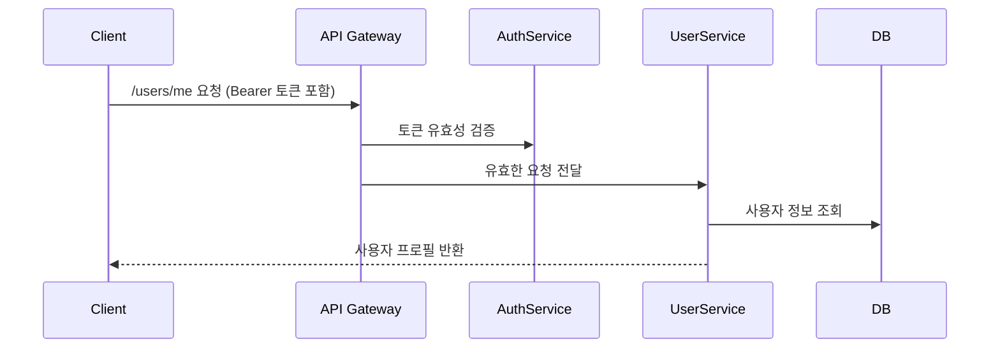

#  User Service - 사용자 정보 관리 마이크로서비스

> `User Service`는 `automation_modules` 프로젝트의 핵심 구성 요소로, 사용자의 **개인 정보 관리**, **계정 프로필 처리**, **비즈니스 도메인 분리**를 담당하는 독립형 MSA 서비스입니다.
>
> 인증·세션은 `auth-service`에서 담당하며, 본 서비스는 사용자 데이터를 중심으로 **정보 조회/수정/삭제 API를 제공**합니다.

---

##  서비스 목적 및 역할

| 항목       | 설명                                      |
| -------- | --------------------------------------- |
| 도메인 책임   | 사용자 기본 정보 관리, 마이페이지 데이터 제공              |
| 인증 방식    | API Gateway에서 AccessToken 검증 후 유저 정보 접근 |
| 데이터베이스   | PostgreSQL + TypeORM ORM 매핑 방식          |
| 아키텍처 포지션 | 인증 분리형 MSA 구조에서 유저 데이터 전담 서비스           |

>  `auth-service`가 인증/보안 책임을 갖고, `user-service`는 **유저 도메인 책임 분리**를 실현합니다.

---

## 🗂️ 폴더 구조

```
user-service/
├── src/
│   ├── controllers/   # REST API 라우팅 및 응답 처리
│   ├── services/      # 핵심 비즈니스 로직 처리 계층
│   ├── repositories/  # TypeORM DB 액세스 모듈
│   ├── dtos/          # 요청/응답 데이터 구조 정의
│   ├── middlewares/   # 오류 처리, 토큰 유저 추출 미들웨어
│   └── configs/       # 데이터베이스 및 환경 설정
├── .env               # 런타임 환경변수 정의 파일
└── Dockerfile         # Docker 컨테이너 빌드 설정
```

---

##  지원 기능 요약

| 기능                          | 상세 설명                           |
| --------------------------- | ------------------------------- |
| 사용자 등록 (POST /users)        | 신규 사용자 정보 저장 (auth 연동 기반)       |
| 사용자 정보 조회 (/users/\:id)     | 유저 ID 기반 프로필 정보 반환              |
| 마이페이지 조회 (/users/me)        | AccessToken 기반 유저 본인 정보 제공      |
| 정보 수정 (PATCH /users/\:id)   | 유저명, 연락처 등 선택 정보 업데이트           |
| 사용자 삭제 (DELETE /users/\:id) | 탈퇴 요청 시 데이터 논리 삭제 또는 비활성화 처리 예정 |

> 모든 API는 Gateway를 통해 JWT 인증을 거쳐야 하며, 인증된 사용자만 접근이 가능합니다.

---

## 🔐 인증 연동 구조



> 유저 정보 접근 권한은 오직 **유효한 AccessToken이 있는 경우에만 허용**되며, `userId`는 토큰 Payload에서 추출됩니다.

---

## ️ 실행 방법

### 1. 환경 변수 설정 (.env)

```env
DB_HOST=localhost
DB_PORT=5432
DB_USER=your_user
DB_PASSWORD=your_password
DB_NAME=user_service
SERVICE_PORT=3001
```

### 2. 실행 명령어

```bash
# 로컬 개발 서버 실행
npm install && npm run dev

# Docker 기반 실행
docker build -t user-service .
docker run -p 3001:3001 --env-file .env user-service
```

> Docker Compose 기반으로 전체 시스템(`auth`, `gateway`, `user`)과 함께 실행할 수도 있습니다.

---

##  테스트 전략

| 테스트 항목     | 설명                              |
| ---------- | ------------------------------- |
| 유닛 테스트     | 각 서비스 로직 함수 단위 테스트 (Jest 기반)    |
| 통합 테스트     | 가입 → 로그인 → 프로필 조회 → 정보 수정 흐름 검증 |
| 인증 Mock 처리 | 테스트 시 JWT 인증은 Mock 방식으로 처리 가능   |
| 데이터 정합성 검증 | 동일 유저에 대해 변경 후 데이터 반영 확인        |

> 커버리지 측정은 `npm run test:cov` 명령어로 확인 가능하며, 90% 이상 목표로 작성 중입니다.

---

##  향후 개선 계획

* [ ] 닉네임/이메일 중복 검사 API
* [ ] 유저 탈퇴 시 데이터 영구 삭제 → 논리 삭제 전환 검토
* [ ] 관리자 전용 유저 검색, 페이징 API
* [ ] Kafka 연동 기반 유저 활동 이벤트 발행
* [ ] 이메일 변경 시 인증 절차 연동

---

##  작성자 정보

| 이름  | 포지션                 | 링크                                                                                   |
| --- | ------------------- | ------------------------------------------------------------------------------------ |
| 박경도 | 백엔드 개발자 (유저 도메인 설계) | [GitHub](https://github.com/Mirandalaw) · [Tistory](https://jeong-park.tistory.com/) |

> 본 문서는 **인사 담당자, 기술 리뷰어, 협업 개발자**가 User Service의 구조, 책임, 기술 수준을 한눈에 파악할 수 있도록 작성되었습니다.
